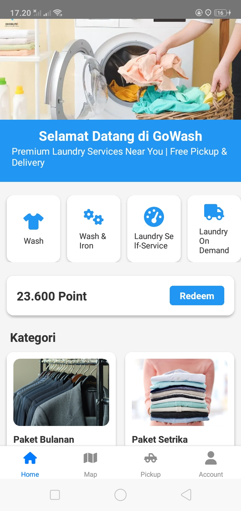
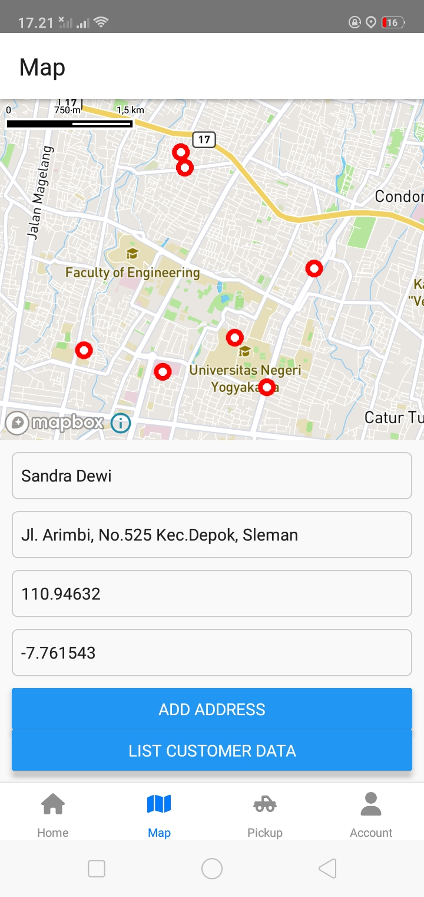
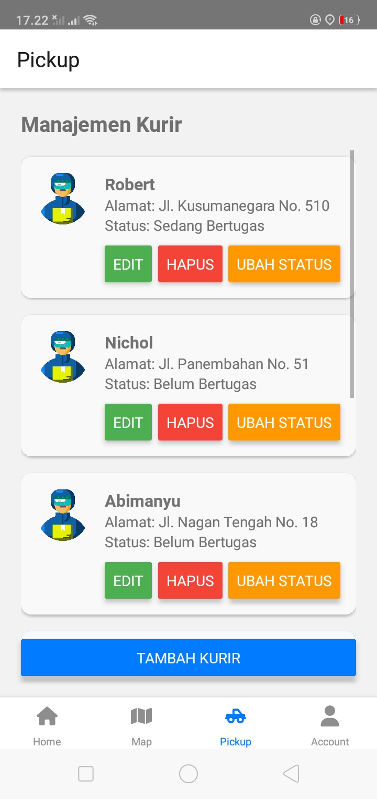
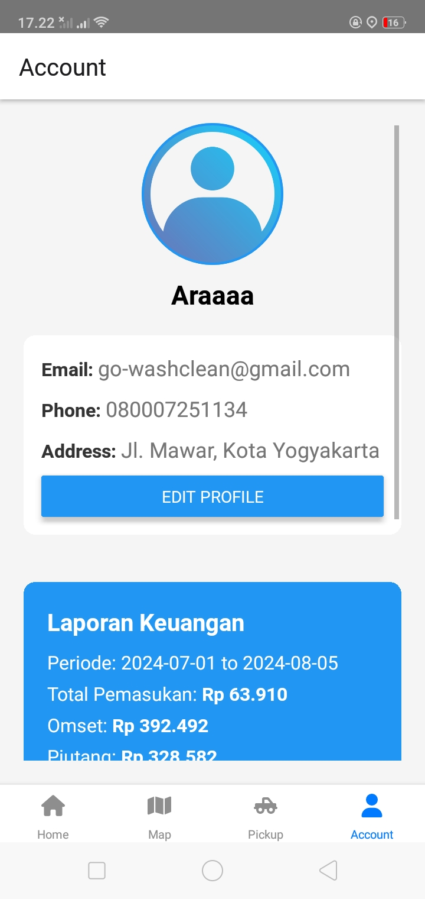

# Go-Wash Clean: The Smart Laundry App with Advanced Customer Mapping, Courier Management, Real-Time Tracking, and Efficient Service Integration, Powered by React Native

## Deskripsi Produk

Aplikasi **Go-Wash Clean** adalah solusi canggih untuk layanan laundry, membantu menemukan, memesan, dan melacak layanan dengan mudah. Aplikasi ini memiliki fitur pemetaan yang akurat untuk memetakan lokasi customer, manajemen kurir untuk monitoring status kurir yang siap atau sedang bertugas. 

### Tab Utama Aplikasi:
1. **Home**: Menampilkan informasi umum dan fitur reedem point.
2. **Map**: Memetakan lokasi sebaran customer.
3. **Pick-Up**: Monitoring status kurir.
4. **Account**: Mengelola data pribadi dan riwayat transaksi.

Dengan antarmuka yang user-friendly dan teknologi terintegrasi, **Go-Wash Clean** menawarkan pengalaman laundry yang lebih efisien dan praktis.

---

## Komponen Pembangun Produk
- **IDE/Editor**: Visual Studio Code
- **Version Control**: GitHub
- **Framework**: React Native
- **Library dan Tools**:
  - FontAwesome
  - React Navigation
  - Fetch JS
  - MapBox

---

## Sumber Data
- **Mapbox API**
- **Google My Business**
- **Kementerian Perindustrian dan Perdagangan**: Data industri kecil dan menengah (IKM), jasa laundry
- **Badan Pusat Statistik (BPS)**: Survei sosial ekonomi nasional (Susenas)

---

## Tangkapan Layar Komponen Penting Produk

  
  
  
  

---